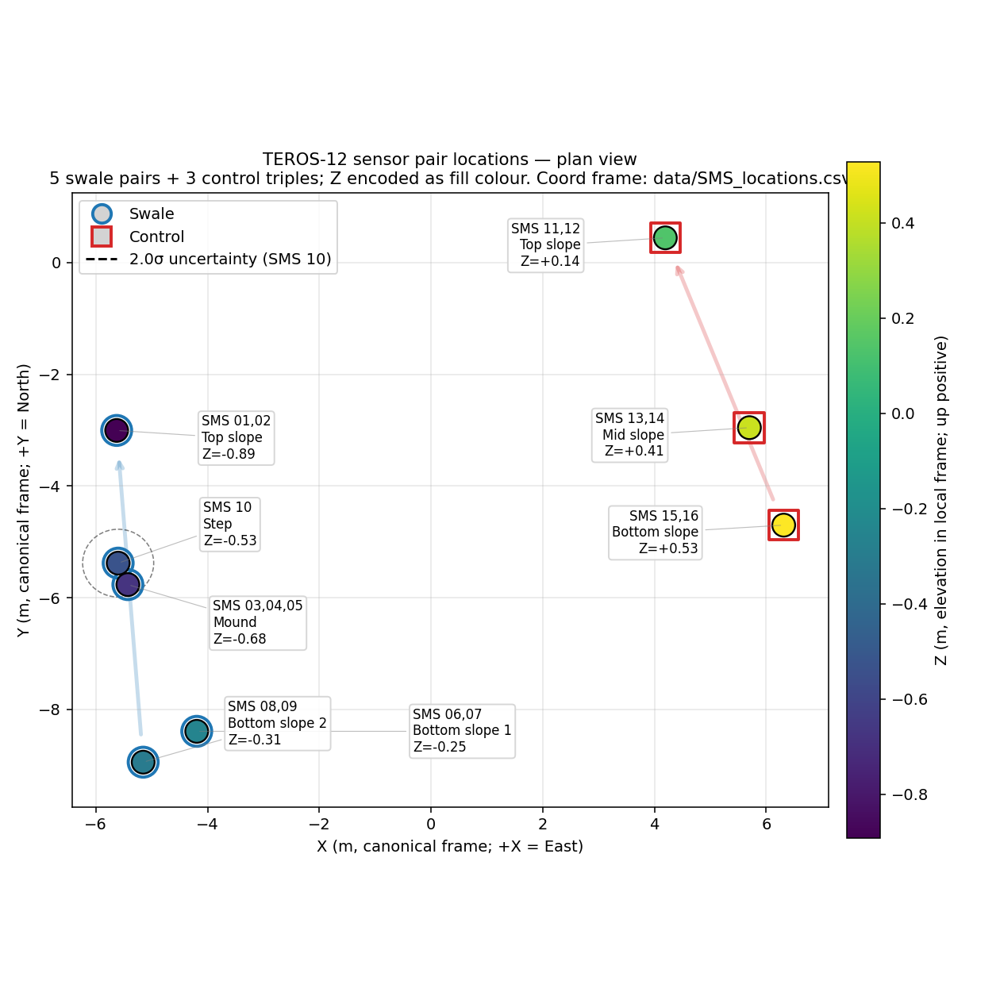
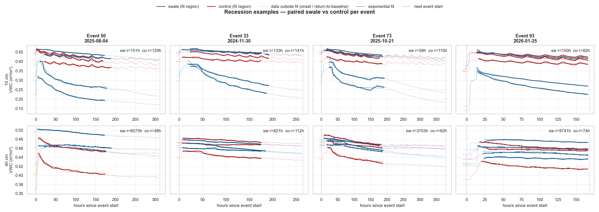
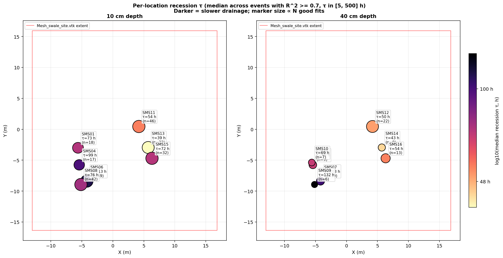

# On-contour swale — Sadhana Forest

**Does a contour swale moderate soil water in a tropical hillslope?**

Two years of 5-min TEROS-12 + LiDAR + Hargreaves-Samani PET
on a paired swale vs control site, Auroville (Tamil Nadu, India).

Alexis · 2026-05

<!-- Slide 1: title -->

---

## The question

A **swale** is a shallow ditch dug along an elevation contour.
Hypothesised to **capture rainwater, slow it down, and let it
infiltrate locally** — moderating monsoon runoff and keeping the
upper soil column wetter into the dry season.

**Test:** instrumented swale strip vs adjacent control hillslope,
8 sensor pairs at 10 cm + 40 cm, paired by slope position.

---

## Data — what we have, what we don't

- **TEROS-12 soil moisture / temp / EC**, 5-min, 8 pairs, 10 + 40 cm
  → 2024-04 to 2026-02 (~22 months)
- **ATMOS-14** (air temp, pressure, humidity, VPD), same logger
- **ECRN-100** tipping-bucket rain gauge
- **Ground LiDAR** (5 dense scans, sub-cm registration)

### Caveats up front

- **Rain gauge is dead from 2025-06-22** (mechanical fault — emits
  continuous 0 mm). Anything rain-forced is bounded above by that
  date. We substitute a **soil-moisture-based event detector**
  beyond it (76 % precision, 86 % recall on validated events).
- Two short data outages early in the record on SMS01–03 + SMS10
  (logger 19570); other sensors are >99.5 % complete.
- SMS02 (Top swale 40 cm) rarely responds — excluded from
  per-location summaries.

---

## Pipeline (16 numbered scripts, run order = filename prefix)

| Stage | What it produces |
|---|---|
| **A** Ingestion | Long-form parquet cache, equilibration cut |
| **B** Event detection | 94 rain events (VWC-based) |
| **C** Time-frequency | PSD + wavelet TFR (appendix only) |
| **D** Per-event metrics | Rising limb, wetting front, recession τ |
| **E** Climate forcing | Daily Hargreaves-Samani PET |
| **F** Topography | DEM, LiDAR averaging, hillshade |
| **G** Spatial drill-down | Layout, per-loc VWC, τ map, **PET regression** |

See `notes/processing_steps.md` for the full play-by-play and
`notes/figures_index.md` for the what/how/why of every figure.

---

## Recession-tail fits — exponential dominates

`07_recession_fits.{csv,png}` — every tail fitted as
`A·exp(−t/τ) + C` and `A·(t − t_peak)^(−α) + C`.

| Model | Median R² | Wins |
|---|---|---|
| **Exponential** | **0.93** | **431 / 470** (92 %) |
| Power-law | 0.79 | 39 / 470 |

→ Report τ from the exponential; the swale behaves like a (slow)
linear reservoir, not a multi-scale heterogeneous sink.

---

## τ by slope position — the gradient that pooling hides

3 figures (Top / Mid+Mound / Bottom), common y-axis, R² ≥ 0.7,
τ ∈ [5, 500] h. Red = control,
blue = swale.

**Top slope:** swale and control overlap. The Top of
the swale ditch is not where the hydrology happens.

---

## τ by slope position — Mid / Mound

**Mid / Mound:** Mound (SMS04) drains slower than control mid
at 10 cm; at 40 cm SMS05 (Mound) overlaps SMS14 (control mid).

---

## τ by slope position — Bottom (the headline)

**Bottom slope:** at 40 cm SMS07 (Bot 1) and SMS09 (Bot 2)
sit visibly above SMS15/SMS16 — this is where the swale's slow
drainage actually concentrates.

---

## The hero figure — τ on the hillshaded map

`11_per_location_tau_map.png`

- Marker colour = log₁₀(median τ)
- Marker size = N good fits
- Hillshade from averaged dense LiDAR scans
- DEM mesh bbox overlaid

**Refines the old headline.** The previous "swale 40 cm τ ≈ 3261 h"
was a pooled-fit artifact. With R² ≥ 0.7 and τ ≤ 500 h, the
slow-drainage signature is spatially concentrated at **SMS07/SMS09
(Bottom 1+2)**, not uniformly across the swale.

---

## Is the Mound wetter? At 10 cm yes, at 40 cm no.

| Depth | Swale Mound | Control Mid | Δ |
|---|---|---|---|
| 10 cm | SMS04: 0.393 | SMS13: 0.363 | **+0.030** |
| 40 cm | SMS05: 0.418 | SMS14: **0.444** | **−0.026** |

The Mound has wider dry-season swings at 40 cm (p10–p90 0.33–0.47
vs 0.42–0.47). Trees on the Mound likely transpire from the
40 cm rooting zone.

---

## When the swale 40 cm responds, it pumps in 2× more water

Of 94 detected events at 40 cm:

- **Response count** ≈ similar (control 28–50 %, swale 19–49 %)
- **Peak amplitude** SMS05 max **0.168**, SMS07 max **0.157**;
  control max ≈ 0.05–0.10
- **Big-event count** (ΔVWC > 0.05): **control 7, swale 17**
  (~2.4× more)

→ Not "more events", but **bigger events** when they happen.

---

## Tree transpiration — the cleanest test

Dry-season window (2024-12 → 2025-04, ≤ 1 mm rain), regress
**centered** daily ΔVWC on **Penman-Monteith FAO-56** PET.

**More-negative β ⇒ more PET-driven loss ⇒ transpiration signature.**

| Position | Sensor | Depth | 7-d β | 7-d R² |
|---|---|---|---|---|
| Mid | SMS14 control | 40 cm | ≈ 0 | 0.00 |
| Mound | SMS05 swale | 40 cm | ≈ 0 | 0.00 |
| Bot | SMS16 control | 40 cm | ≈ 0 | 0.02 |
| **Bot 1** | **SMS07 swale** | **40 cm** | **−0.60** | **0.30** |

→ Only SMS07 has a robust, scale-stable transpiration coupling.

Conclusion is robust to the PET method
(PM-FAO vs HS gives β = −0.60 vs −0.71, R² = 0.30 either way) and
to the differencing scheme (forward vs centered → same β).

---

## PET regression at the Mound — weak / inconclusive

Daily β = −0.44 at SMS05 looks promising, but it
**washes out under 7-day smoothing** (β → −0.08) → mostly short-term
covariance noise, not a seasonal coupling.

---

## PET regression at the Bottom — robust transpiration signal

SMS07 (Bot 1 swale 40 cm): β stable at ≈ −0.7
across daily and 7-day scales, R² rises from 0.18 → 0.30. The
control twin SMS16 sits at zero. Trees at the foot of the slope —
the largest and most water-secure on the site — transpire from a
40 cm rooting zone.

---

## Story converges on the Bottom slope

The swale's hydrologic effect is **not** uniform across the
construction. **Bottom slope 1+2** is where two independent
analyses agree:

1. Slow recession τ at 40 cm (SMS07 = 103 h, SMS09 = 132 h)
2. Strong negative PET ↔ ΔVWC coupling at 40 cm (SMS07 β ≈ −0.7)

Both are **absent at the matched control sensors** (SMS15, SMS16).

Interpretation: at the foot of the slope, trees are biggest, root
systems most developed, and the swale's water-redistribution effect
most concentrated. The "swale stores water" effect is real — but
geographically focused on where the slope flattens.

---

## PET — what is measured vs assumed (transparency slide)

We compute **Penman-Monteith FAO-56** (Allen et al. 1998 Eq. 6) as
the reference, with Hargreaves-Samani kept as a fallback.

| Input | Source | Status |
|---|---|---|
| `T_max`, `T_min` daily | ATMOS-14 air-temp | **measured** |
| `P` atmospheric pressure | ATMOS-14 atm_pressure | **measured** |
| `ea` actual vapour pressure | ATMOS-14 vapor_pressure | **measured** (since 2024-07-23) |
| `u₂` wind speed | — | **assumed 2 m/s** (FAO-56 §3.3 default — no anemometer) |
| `Rs` solar radiation | — | **estimated** `K_rs · √ΔT · Ra` (FAO-56 Eq. 50; K_rs = 0.19 coastal) |
| `Ra` extraterrestrial radiation | computed | latitude + Julian day (FAO-56 §3.5) |

**Result:** PM-FAO mean ≈ 3.5–4.5 mm/day; HS over-predicts by
~10–30 % in this humid-tropical climate (Tabari 2010; Sentelhas et al.
2010). PM-FAO is the FAO + WMO reference and is what LGAR-Py expects
as its ETo forcing.

**Highest-impact upgrade:** a cup anemometer
($100) would remove the wind assumption. After that, a pyranometer
for measured Rs.

---

## Outlook

### Next phase — Richards-equation forward modelling

LGAR-Py (Layered Green-Ampt with Redistribution) calibrated to
reproduce observed VWC at 10 + 40 cm for each slope position.
Setup in `notes/lgar_design_choices.md`.

- Force with measured rainfall (gauge-valid window) + HS PET
- Test physics with vs without root-water-uptake (Feddes-style)
- Deliverable: matched observed-vs-simulated time series per
  slope position

### Open items

- **Get the rain gauge fixed on-site** (silent since 2025-06-22)
- Resolve SMS 6,7 vs 8,9 layout ambiguity in `SMS_locations.csv`
- Diurnal stacking: revisit if/when we have a measured
  pyranometer to detrend the TEROS-12 dielectric T artifact

---

## Take-aways

1. **The swale slows drainage**, especially at 40 cm at the
   downslope foot — not uniformly across the construction.
2. **Per-event amplitudes are 2× bigger** at the swale 40 cm
   when it responds, even though the response count is similar.
3. **Trees at Bottom 1 transpire from 40 cm** — clean PET coupling
   signal absent in the matched control.
4. **Geography matters.** The swale's effect concentrates where the
   slope flattens — analyses that pool all sensors miss this.
5. **Next:** forward physics simulation to close the loop on the
   water balance.

Thanks. Questions?
